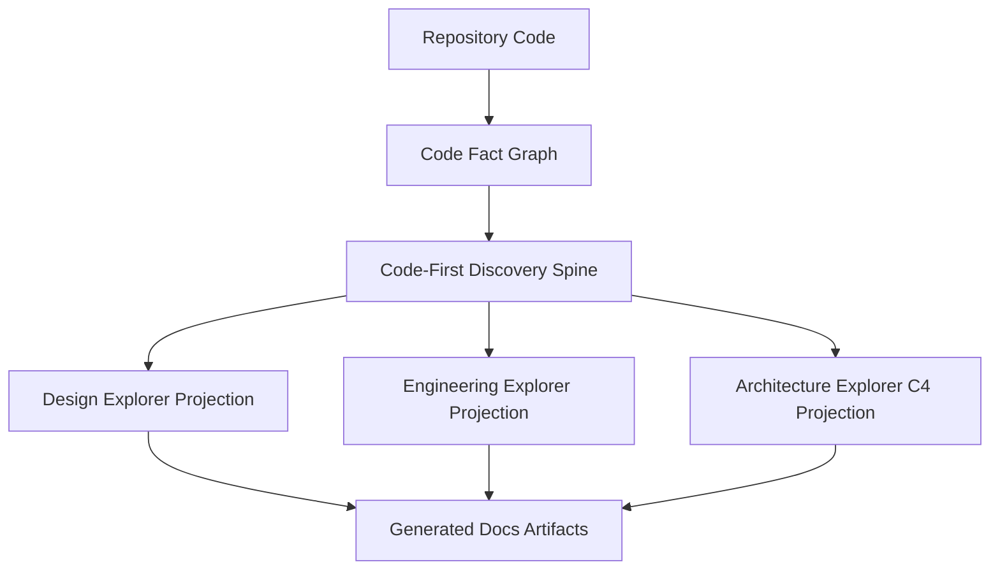
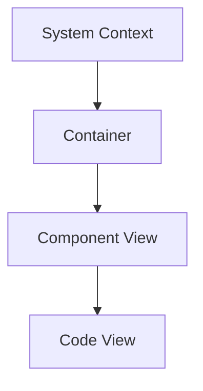

# Code-First Discovery Spine

Status: active specification

Praxis Studio 的 Design Explorer、Engineering Explorer、Architecture Explorer 必须从同一份代码事实理解中生长。当前阶段不使用文档来证明代码事实；`docs/design`、`docs/engineering`、`docs/architecture` 是生成产物，代码/文档一致性属于后续独立能力。

## Problem

如果三个 Explorer 各自扫描、各自解释，系统会产生三类漂移：

- Design 从一组入口和故事解释代码。
- Engineering 从另一组 package、component、hotspot 解释代码。
- Architecture 把 C4 层级生成为平铺列表，无法说明 System Context、Container、Component、Code View 的树型归属。

这种漂移会让用户看到互相不自洽的设计、工程和架构面板。真正的现实来源只能是代码和 Code Fact Graph。

## Source Of Truth

当前事实来源只有：

- repository code scan
- Code Fact Graph snapshot
- Code Fact Graph 中的 file、node、edge、evidence、warning

当前非事实来源：

- `docs/design/**`
- `docs/engineering/**`
- `docs/architecture/**`
- Project Memory 文档解释
- 之前生成的 C4/Engineering/Design HTML

这些非事实来源可以作为 UI 展示、历史产物或未来一致性检查输入，但不能作为当前 discovery 的候选成立证据。

## Runtime Contract

Runtime CLI 需要先生成 Code-First Discovery Spine，再由三个 Explorer 投影：



The runtime command is:

```text
praxis-runtime code-understanding:spine --root <repo>
```

The command writes:

- `docs/code-understanding/code-first-discovery-spine.md`
- `docs/code-understanding/code-first-discovery-spine.json`

`design:discover`、`engineering:discover`、`architecture:discover` 必须生成或读取同一类 spine，并在输出中暴露 spine 路径。

## Spine Model

The schema is implemented in:

- `packages/schema/src/code-understanding-spine.ts`
- `packages/schema/src/code-understanding-spine.schema.ts`

Runtime builder:

- `apps/runtime-cli/src/code-understanding-spine.ts`

The spine contains:

- `behaviorSlices`: 从入口、CLI 命令、UI 路由、事件处理、测试、runtime config 等触发点恢复的行为切片。
- `structuralClusters`: 从模块路径、符号、边、入出依赖恢复的结构簇。
- `runtimeBoundaries`: 从 package、Tauri、Vite、CLI、Rust、测试、构建配置等文件恢复的运行边界。
- `evidenceClaims`: 把行为、结构、依赖、运行边界转为可投影的证据声明。
- `coverageLedger`: 每个文件、符号、边、入口、package、runtime boundary 必须被解释、排除、标记为内部细节，或进入 gap。
- `reconciliation`: 三个 Explorer 的共同对齐面。它记录被链接的行为切片、结构簇、运行边界和仍未解释的 gap。

## Panel Projection Rules

### Design

Design Explorer 解释业务复杂度。它只能把代码事实投影成候选故事、参与者、Use Case 和下钻图。

Allowed:

- 从 `behaviorSlices` 找触发点。
- 从 UI route、CLI command、event handler 推断候选用户操作或系统行为。
- 把不明确意图标记为 question/gap。

Forbidden:

- 从 `docs/design` 反推 Use Case。
- 把命名相似当作确认的业务意图。
- 把技术结构直接等同为业务故事。

### Engineering

Engineering Explorer 解释技术复杂度。它从 spine 的 structural cluster、runtime boundary、edge 和 coverage ledger 中生成 UML/技术图。

Allowed:

- package diagram 解释模块边界和依赖方向。
- component/class/sequence/state/hotspot 图解释技术结构、协作和治理风险。
- 将业务关联写成候选关系。

Forbidden:

- 把目录列表包装成 package diagram。
- 把 component diagram 写成文件卡片。
- 让 UI 临时补解释。

### Architecture

Architecture Explorer 解释 C4 抽象层级。C4 必须是树型下钻：



Rules:

- System Context 只能说明系统与外部人、外部系统、仓库、模型服务和生成产物的关系。
- Container 来自具有可解释工程边界或运行边界的结构簇，不等于任意目录。
- Component View 必须属于某个 Container。
- Code View 必须从某个 Component View 下钻而来，展示能解释组件实现的少量代码锚点。
- C4 根索引输出 `tree` 作为权威结构，`categories` 只用于兼容旧 UI。

## Coverage Ledger

每一轮 discovery 后，覆盖台账必须能回答：

- 哪些入口被 Design 解释？
- 哪些模块/结构被 Engineering 解释？
- 哪些边界被 Architecture 解释？
- 哪些文件、符号或关系只是内部细节？
- 哪些东西仍然是 unknown gap？

如果某个对象既没有被解释，也没有被排除，就不能假装完整；必须进入 `unknown_gap`。

## Prompt Contract

Agent prompt 必须使用 spine 作为共同上下文：

- `packages/prompt-registry/prompts/code-understanding-spine.md`
- `packages/prompt-registry/prompts/design-discovery-use-cases.md`
- `packages/prompt-registry/prompts/engineering-discovery-diagrams.md`
- `packages/prompt-registry/prompts/architecture-discovery-c4.md`

Prompt must state:

- Code is reality.
- Docs are generated projection artifacts.
- Design/Engineering/Architecture are three projections from the same spine.
- Do not use generated docs as source evidence.
- Mark uncertainty as candidate, inference, question, or gap.

## Acceptance

Implementation is complete when:

- `npm run typecheck -w @praxis/schema` passes.
- `npm run typecheck -w @praxis/runtime-cli` passes.
- `npm run typecheck -w @praxis/studio-desktop` passes.
- `npm run build -w @praxis/runtime-cli` passes.
- `praxis-runtime code-understanding:spine --root <repo>` writes markdown and JSON.
- `engineering:discover` output contains spine document paths.
- `architecture:discover` output contains spine document paths and C4 index JSON has `tree`.
- Architecture side tree renders System Context -> Container -> Component -> Code View, not flat categories.
